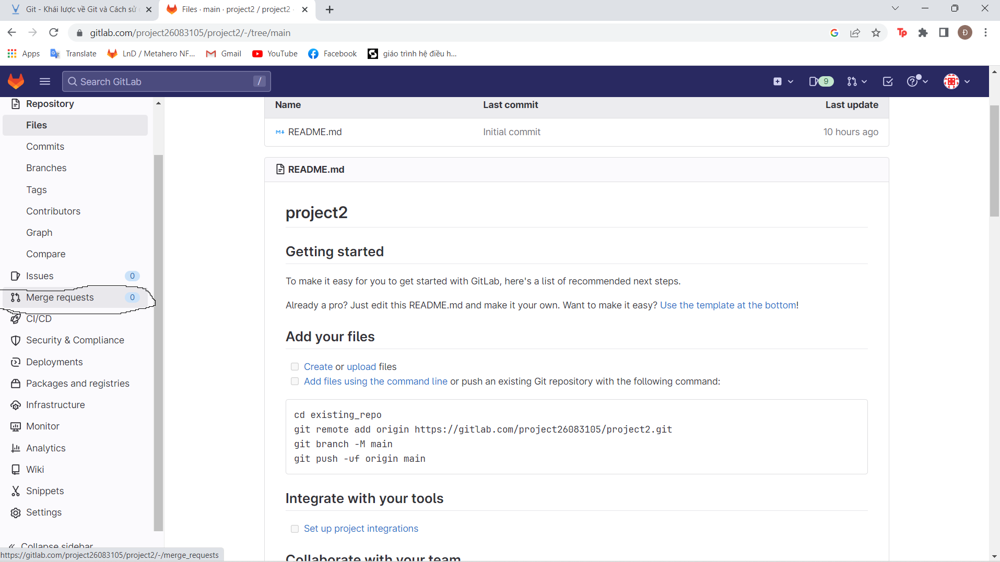
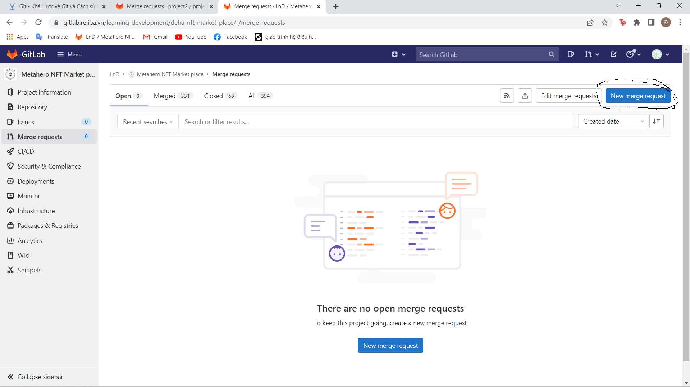
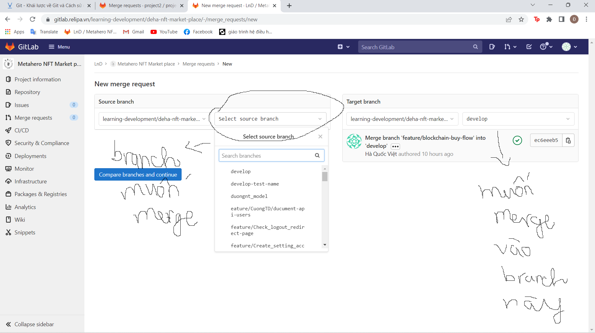
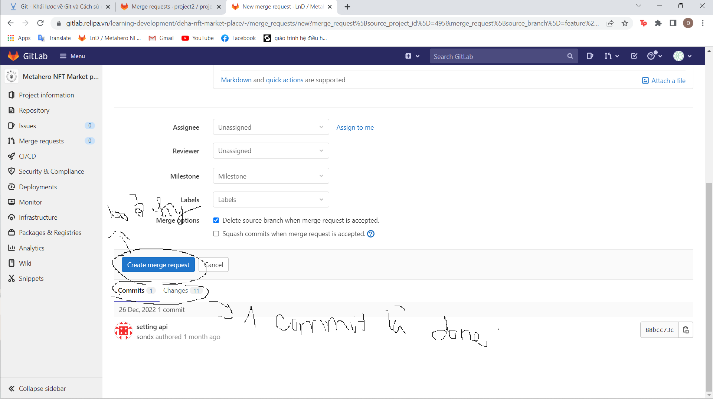

## Lưu ý chúng ta sẽ clone và pull code về từ nhánh develop sau đó checkout ra nhánh mình làm xong đẩy lên nhánh của mình r tạo merge request trên gitlab. Nhóm trưởng sẽ review code nếu ok thì sẽ merge vào nhánh develop

## Quy tắc là khi merge request không được quá 1 commit và không được có commit behide nào nếu không sẽ bị reject code

### Tạo kho lưu trữ git cục bộ cho một dự án

- Khi trong dự án chưa có folder .git thì mới dùng bước này. Còn nếu có rồi hoặc pull về từ một remote repo thì sẽ không cần nữa:
- Cú pháp:

```javascript
git init
```

### Một vài khái niệm cơ bản

**_1. Repository:_**

- Repository là nơi sẽ ghi lại trạng thái của thư mục và file. Trạng thái được lưu lại đang được chứa như là lịch sử thay đổi của nội dung. Bằng việc đặt thư mục muốn quản lý lịch sử thay đổi dưới sự quản lý của repository, có thể ghi chép lại lịch sử thay đổi của thư mục và file trong thư mục đó. Hay nói cách khác nó chính là một kho lưu trữ source code của mình. (Viết tắt là **repo**)
- Repo có 2 loại:
  - Remote repository: Là repository để chia sẻ giữa nhiều người và bố trí trên server chuyên dụng. (Ví dụ như github, gitlab,... )
  - Local repository: Là repository bố trí trên máy của bản thân mình, dành cho một người dùng sử dụng. Những folder có folder .git thì nó là 1 local repo.

**_2. Staging and Committing:_**

- **Commit** là quá trình trong đó source code được thêm vào kho lưu trữ cục bộ. Trước khi commit, source code phải nằm trong khu vực được chuẩn bị cho quá trình commit.
- Khu vực này theo dõi tất cả các files sẽ được commit, file không được thêm vào khu vực này sẽ không được commit - Điều này cho phép các developer kiểm soát được những tệp file cần commit.
- **Staging** chính là khu vực chuẩn bị cho quá trình commit.

**_3. Branch:_**

- Branch là cái dùng để phân nhánh và ghi lại luồng của lịch sử. Branch đã phân nhánh sẽ không ảnh hưởng đến branch khác nên có thể tiến hành nhiều thay đổi đồng thời trong cùng 1 repository.


- Tại sao cần nhiều nhánh ???: Cần nhiều nhánh để hỗ trợ nhiều phát triển song song. Chi tiết hoạt động của các nhánh tham khảo hình sau đây.
  

  - Đầu tiên, commit 1 và commit 2 được thực hiện trong nhánh Master. Sau commit 2, một nhánh mới được gọi là “Test” được tạo ra, commit 3 và commit 4 được thêm vào nhánh Test này.
  - Đồng thời, commit 3 và commit 4 khác được thêm vào nhánh Master. Ở đây chúng ta có thể thấy rằng sau commit 2, hai phát triển song song đang được đồng thời thực hiện ở 2 nhánh riêng biệt.
  - Nhánh Test và nhánh Master tách ra ở đây, chứa source code khác nhau - source code từ nhánh Test có thể được gộp vào nhánh Master bằng cách sử dụng git merge mà tôi sẽ đề cập tới sau đây.

### Git status, git log, git commit, git add

- **Status:** Sử dụng git status để biết được tệp nào đã được sửa đổi, tệp nào nằm trong khu vực được chuẩn bị cho quá trình commit - ngoài ra còn nhiều thông tin khác nữa mà tôi sẽ bỏ qua trong bài viết này.

```java
git status
```

- **Git commit:** Để tạo 1 commit mới:

```java
git commit -m "son"
// sau -m là đặt tên cho commit 1 tên bất kỳ

// nếu mới gộp commit gộp với commit cũ cuối cùng từ trước thì dùng:
git commit --amend -m "ten_commit"
```

- **Git add:** Để thêm các file vào staging

```java
// Có thể thêm 1 file:
git add ten_file

// Có thể thêm nhiều file
git add file1 file2 ...

// Có thể thêm tất cả các file:
git add .
```

- **Git log:** Git log để xem lịch sử các commit

```java
git log

// Nếu muốn xem lịch sử 1 cách gọn gàng hơn
git log --oneline
```

### Git branch

- Để xem mình đang ở branch nào:

```java
git branch
```

- Để tạo 1 branch mới:

```java
git checkout -b ten_branch
```

- Chuyển sang một branch:

```java
git checkout ten_branch
```

### Git clone

- Git clone được sử dụng để sao chép một kho lưu trữ từ xa vào máy tính của bạn. Command cho việc này là:

```java
git clone -b ten_branch repository_url
```

### Git remote

- Nếu như không clone code về từ một remote repo thì mới cần làm bước này:
- Để trỏ kho lưu trữ cục bộ của bạn đến kho lưu trữ từ xa, hãy sử dụng lệnh sau:

```java
git remote add origin [repository url]
```

### Git push

Để đẩy tất cả source code từ kho lưu trữ cục bộ vào kho lưu trữ từ xa, chúng ta sẽ sử dụng câu lệnh sau đây:

```java
git push origin ten_branch_muon_day

// Nếu như sau khi commit --amend hoặc rebase thì cần dùng câu lệnh sau k dùng đc câu lệnh trên
git push origin -f ten_branch_muon_day
```

### Git pull

- Git pull được sử dụng để kéo những thay đổi mới nhất từ kho lưu trữ từ xa vào kho lưu trữ cục bộ.
- Source code trong kho lưu trữ từ xa được cập nhật liên tục bởi nhiều developer khác nhau, do đó, Git Pull là rất cần thiết.

```java
// Lưu ý đứng ở branch nào thì pull code về từ nhánh đấy trên remote repo nếu không sẽ mất code
git pull origin ten_branch
```

### Các bước đẩy code sau khi mới clone dự án về:

1. Check xem code có thay đổi gì không

```git
git status
```

2. Nếu có code thay đổi thì thêm những file thay đổi cần thiết và staging:

```git
git add ten_file ...
hoặc
git add .
```

3. Kiểm tra xem các file cần commit đã được thêm vào staging chưa:

```git
git status
```

4. Nếu đã được thêm đầy đủ vào staging thì tiến hành commit

```git
git commit -m "ten_commit"
```

5. Đẩy code lên remote repo:

```git
git push origin url_repo tên branch
```

6. Tạo merger request trên gitlab
   
   <br>
   
   <br>
   
   <br>
   
   <br>
   

### Các bước thực hiện khi đã ít nhất commit 1 lần từ nhánh của mình

1. Checkout sang nhánh develop:

```java
git pull origin develop
```

2. Code trên nhánh develop:
3. Code xong thì git status r git add
4. Sau khi git add thì:

```java
git stash
```

5. Checkout sang nhánh của mình:

```java
// Nếu mình chưa có nhánh nào thì dùng
git checkout -b ten_branch

// Nếu đã có nhánh r thì:
git checkout ten_branch
```

6.

```java
git stash pop
```

7.

```java
git add .
```

8.

```java
git commit --amend -m "ten_commit"
```

9.

```java
git push origin -f HEAD
// HEAD đại diện cho nhánh hiện tại
```

10. Sau đó tạo merge request như trên

- **_Chú ý mỗi lần định commit phải check branch hiện tại phải là branch của mình không được commit vào branch develop bằng lệnh: "git branch". Nhánh nào màu xanh là nhánh mình đang ở. Đồng thời cũng phải check lịch sử commit bằng lệnh "git log --oneline", nếu như có 1 commit của mình r thì dùng "git commit --amend -m "ten_commit"", còn nếu chưa có commit nào thì dùng "git commit -m "ten_commit""._**

### Cách giải quyết khi có conflict

- Nếu như lúc tạo merge request thấy bị block merge và hiện là merge bị conflict thì resolve:

1. Mở PowerShell trỏ đến dự án của mình.
2. Check đang ở branch nào:

```java
git branch
```

3. Từ nhánh mình checkout sang nhánh develop (nếu đang ở nhánh develop r thì k cần checkout nữa)

```java
git checkout develop
```

4. Lấy code mới nhất về từ nhánh develop

```java
git pull
```

5. Checkout sang nhánh của mình (chú ý là nhánh mình muốn merge vào develop đang bị conflict)

```java
git checkout ten_branch
```

6. Sử dụng rebase

```java
git rebase develop
```

7. Check xem những file nào đang vị conflict bằng cách dùng git status, những file nào màu đỏ là đang bị conflict, mở eclipse hoặc vscode hoặc intellj vào những file dó:

```java
git status
```

8. Vào từng file để sửa. Các file bị conflict sẽ đề hiện dòng code nào đang bị conflict và đưa ra 2 lựa chọn là chọn code của mình hoặc chọn code của nhánh develop. Nếu chọn code nào thì xóa code còn lại đi. Sửa như thế tất cả các file và nhớ lưu từng file 1.
9. Khi đã sửa xong ra powershell:

```java
git add .
```

10. Sau khi add xong thì sử dụng lệnh:

```java
git rebase --continue
```

11. Sau khi đnáh lệnh trên và enter thì nó sẽ vào 1 text editor mặc định trên máy. Thường là Vim nên chỉ cần gõ:

```java
:wq và enter
```

Còn nếu :wq k được thì hỏi t. 12. Sau khi :wq enter nó sẽ thoát ra lại powershell. Nếu nó hiện ra suscessfully thì là thành công còn nếu không thì lại tiếp tục thực hiện lại từ bước 7 đến bước 12. (để cho chắc là thành công hay chưa thì cứ check kể cả có suscessfully bằng lệnh git status. Nếu còn file đỏ thì là con conflict và làm lại từ bước 7) 12. Push code lên git

```java
git push url HEAD -f
```

Nó sẽ tự cập nhập vào merge request
vào merge request của mình xem còn bị conflict không nếu không thì gửi vào nhóm để nhóm trưởng review

**_CHÚ Ý: Trong quá trình rebase trên TUYỆT ĐỐI không được commit nếu không là mất code._**

**_CHÚ Ý: Trước khi code thì lúc nào cũng phải "git pull" để lấy code mới nhất (Nhớ là đứng trên nhánh develop thì mới dùng git pull) về rồi mới code tránh tình trạng conflict và code trên nhánh develop nhưng k được commit vào nhánh develop. Nếu nhỡ commit vào nhánh develop thì bảo t để t giúp xử lý_**

## CHÚC ANH CODE VÀ DÙNG GIT VUI VẺ
